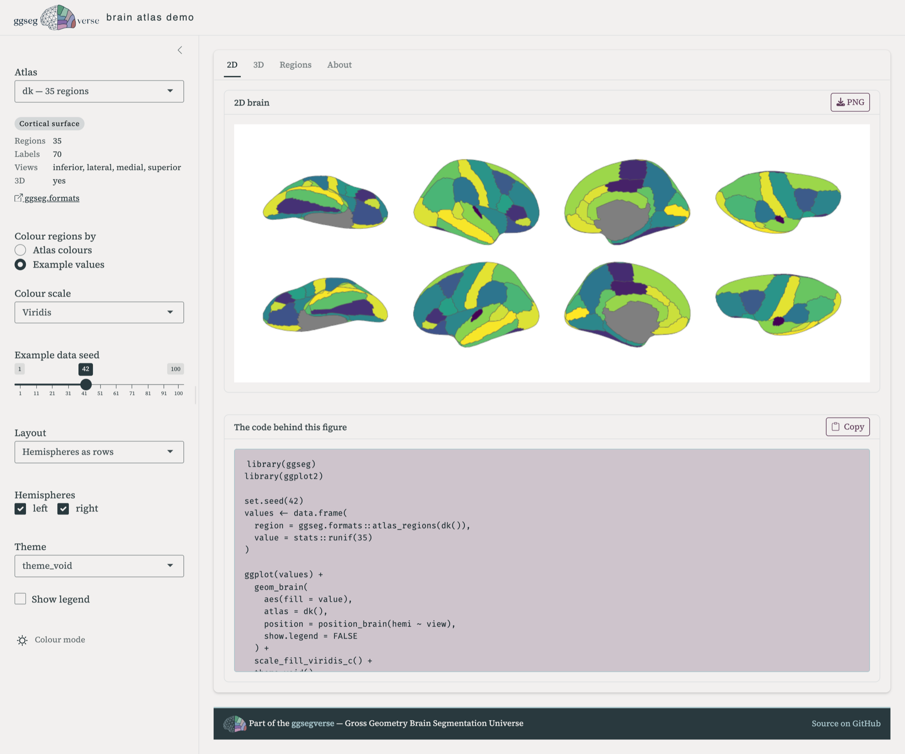
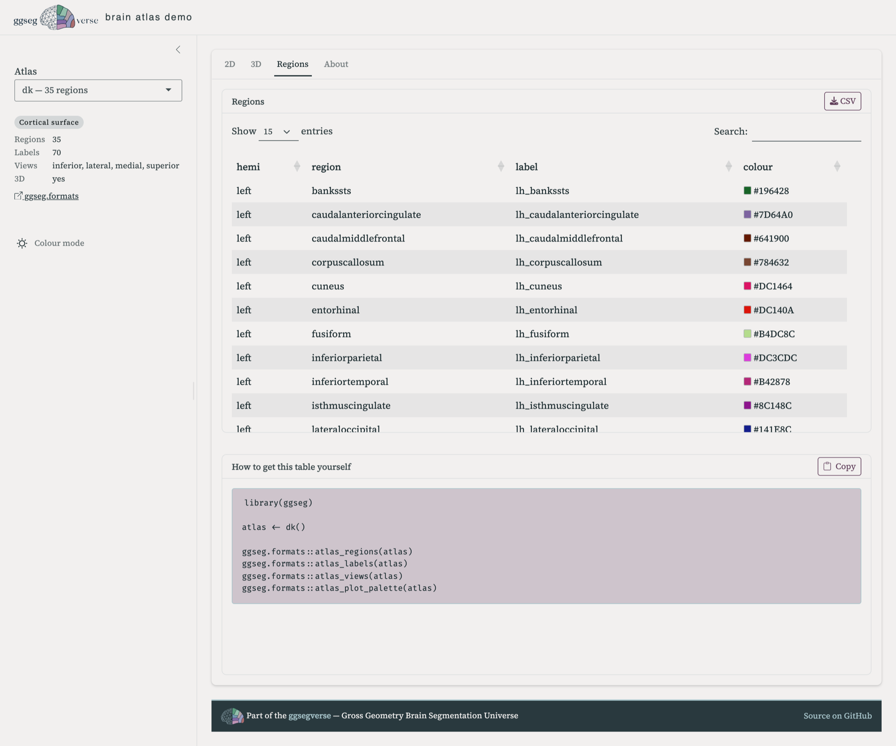

Until this week, the [playground](/playground) on this site was 27 pictures in a trenchcoat.

Three atlases, a handful of views, a few colour scales, every combination rendered ahead of time and swapped in by JavaScript when you clicked something.
It looked interactive.
It was a slideshow.
And the code block under each figure was a caption — hand-written to describe what you were looking at, with nothing checking that it still did.

The playground now embeds the [ggsegverse demo app](https://drmowinckels-ggsegverse-demo.share.connect.posit.cloud), and the difference that matters isn't the atlas count.
It's that the app draws each figure by _running_ the snippet it shows you.

## The code and the picture cannot drift apart

This is the whole design.
Every control in the sidebar rewrites the R under the figure, and that rewritten R is what gets evaluated to produce the figure.
There is no second code path that renders the plot while a display string pretends to explain it.

So when you copy the snippet out — and there's a copy button, because copying out of a web page is otherwise a small misery — it runs unchanged in your own session.
Same atlas, same layout, same theme, same plot.
If it didn't, the app would be showing you a different picture than the one it made.

## Which also makes it a way to learn the packages

The snippet sits in a panel directly under the figure, so every control is a small experiment with the answer written out in R.
Tick _Show legend_ and `show.legend = FALSE` disappears from the `geom_brain()` call.
Switch the layout and you watch the `position_brain()` formula go from `hemi ~ view` to `. ~ hemi + view`.
Colour by example values instead of the atlas palette, and the whole shape of the code changes — a `set.seed()`, a `values` data frame built from `atlas_regions()`, and `aes(fill = value)` in place of `aes(fill = region)`.

That last one is the pattern most people actually need, and it's the one that's hardest to guess from the reference docs.
If you've ever known roughly what you wanted a brain plot to look like but not which argument got you there, clicking until the picture is right and then reading the code off the screen is a quicker route than the function index.

{fig-alt="The demo app in 2D view. A sidebar on the left holds the atlas picker, a Colour regions by radio set with Example values selected, a Viridis colour scale, a seed slider, and layout and theme pickers. The main panel shows the Desikan-Killiany atlas drawn in eight views, two rows of four, each region filled from a viridis scale. Below the figure a code panel titled The code behind this figure shows the R script that made it, beginning with library(ggseg) and library(ggplot2)."}

Nothing is trimmed for looks, either.
The snippets include the `library()` calls and the atlas constructor, so they're complete scripts rather than fragments you have to reassemble around.

## What's in it

All 71 atlases in the ecosystem, across 19 packages: 46 cortical, 14 subcortical, 8 cerebellar, and 3 tract atlases.
Pick one and the sidebar tells you how many regions and labels it has, which views it supports, and links to its pkgdown site.

In 2D you can colour regions by the atlas's own palette or by example values, which is where the colour scales and the seed slider come in — useful for seeing what your own statistics will look like before you have them.
Cortical atlases get the `position_brain()` layouts, slice atlases get their own, and the four brain themes are all there.

In 3D you get surface choice, hemispheres, twelve camera presets, and a background picker.
68 of the 71 atlases have 3D geometry; the three that don't say so rather than failing quietly.

{fig-alt="The demo app in 3D view. The sidebar offers Surface, Hemispheres, Add glass brain, Camera and Background controls. The main panel shows an inflated left hemisphere seen from the lateral side, each cortical region a different colour, with a region legend to the right. The code panel below reads library(ggseg3d), then a ggseg3d call with atlas and surface arguments piped into pan_camera and set_background."}

There's also a Regions tab — the full region and label table for the selected atlas, with its plot colours as swatches, downloadable as CSV.
Mapping your own data onto an atlas means matching its labels exactly, and if you want you can download them there.
The atlas regions are of course easily available in R too with `atlas_regions()` and `atlas_labels()`.

{fig-alt="The demo app showing the Regions tab. A sortable, searchable table lists hemisphere, region, label and colour for the Desikan-Killiany atlas, one row per region, each colour shown as a small swatch next to its hex code. A CSV download button sits in the card header. Below, a panel titled How to get this table yourself shows calls to atlas_regions, atlas_labels, atlas_views and atlas_plot_palette."}

## It replaces the old demo

The [original ggsegDemo](https://athanasiamo.shinyapps.io/ggsegDemo/) covered seven atlases and two kinds of plot, and it has been showing its age for a while.
This supersedes it.

The source is at [ggsegverse/demo](https://github.com/ggsegverse/demo), and it runs locally — the README has the install line.
Running it yourself is also how you'd add an atlas that isn't there yet: the registry is generated from whatever ggsegverse packages are published on [r-universe](https://ggsegverse.r-universe.dev), so a new atlas package shows up in the app once it's released there.

If an atlas renders badly, or a snippet doesn't reproduce what you saw, that's a bug worth knowing about — [open an issue](https://github.com/ggsegverse/demo/issues).
